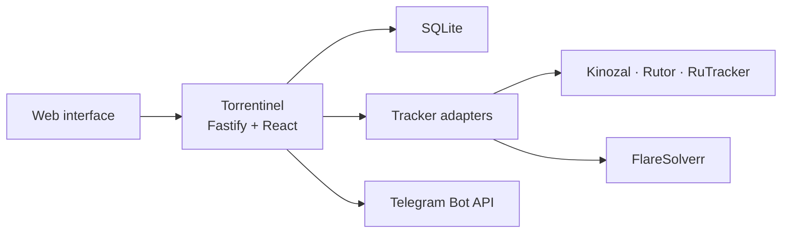

<p align="center">
  
</p>

<p align="center">
  A private, self-hosted monitor for torrent release changes.
</p>

<p align="center">
  <a href="LICENSE"></a>
  <a href="https://hub.docker.com/r/bah0/torrentinel"></a>
  <a href="https://github.com/ib0ndar/Torrentinel/releases"></a>
</p>

Torrentinel watches torrent releases and tells you when something changes. It supports direct-link subscriptions, phrase-based rules, personal collections, and Telegram notifications through a responsive web interface.

## Features

- Direct-link monitoring for title, cover, magnet, torrent-file, and metadata changes
- Case-insensitive rule subscriptions with required and ignored phrases
- Per-user collections, history, and read/unread state
- Telegram notifications with artwork and release links
- Persistent cover fallback when an image host is temporarily unavailable
- Tracker credentials, mirrors, and Telegram bots configured from the web interface
- Administrator-managed accounts with no public registration
- Configurable polling from 5 minutes to 6 hours
- Persistent RuTracker feed buffering with overlap monitoring and authenticated gap recovery
- Tracker diagnostics with seven-day log retention
- Encrypted credentials and bot tokens in SQLite
- Modular TypeScript tracker adapters
- Multi-architecture images for `linux/amd64` and `linux/arm64`

## Screenshots

### Monitor


### Subscription details


### Administration


## Supported trackers

| Tracker | Direct links | Rules | Login |
| --- | --- | --- | --- |
| [Kinozal](https://kinozal.tv/) | Yes | Yes | Required |
| [Rutor](https://rutor.is/) | Yes | Yes | No |
| [RuTracker](https://rutracker.org/) | Yes | Yes | Optional |

## Quick start

### Docker Compose

Docker Compose is the simplest way to run Torrentinel. It starts the application and a private FlareSolverr sidecar used for RuTracker detail pages and authenticated feed-gap recovery.

```sh
git clone https://github.com/ib0ndar/Torrentinel.git
cd Torrentinel
docker compose up -d
```

Open [http://localhost:8080](http://localhost:8080) and sign in with:

```text
Username: admin
Password: admin
```

The default password must be changed after the first sign-in.

To use a different port or public address:

```sh
TORRENTINEL_PORT=8999 \
PUBLIC_URL=https://torrentinel.example.com \
docker compose up -d
```

Common commands:

```sh
docker compose pull
docker compose up -d
docker compose logs -f torrentinel
docker compose down
```

Application files and the SQLite database are stored in the `torrentinel_app` and `torrentinel_db` named volumes.

### Docker without Compose

The application can run by itself if RuTracker browser resolution and authenticated feed-gap recovery are not required:

```sh
docker run -d \
  --name torrentinel \
  --restart unless-stopped \
  -p 8080:8080 \
  -v torrentinel_app:/var/lib/torrentinel \
  -v torrentinel_db:/data \
  -e PUBLIC_URL=http://localhost:8080 \
  bah0/torrentinel:v0.4.1
```

### Rootless Podman on RHEL

The `deploy/` directory contains Quadlet units for a rootless Podman deployment with named volumes, health checks, SELinux labeling, and an internal FlareSolverr network.

```sh
podman pull docker.io/bah0/torrentinel:v0.4.1
podman volume create torrentinel_app
podman volume create torrentinel_db

install -d -m 0700 ~/.config/containers/systemd
install -m 0644 deploy/*.container deploy/*.network ~/.config/containers/systemd/

sudo loginctl enable-linger "$USER"
systemctl --user daemon-reload
systemctl --user start torrentinel.service
```

The supplied unit publishes Torrentinel on TCP port `8999`. Update `PUBLIC_URL` in `deploy/torrentinel.container` when the service is accessed through a reverse proxy or another hostname.

## Configuration

Tracker accounts, mirrors, and Telegram bots are configured from **Settings**. A RuTracker login is optional for ordinary public-feed monitoring and required only for authenticated recovery after a detected feed gap. The polling interval and user accounts are managed from **Administration**.

The configured polling interval is the actual tracker request interval. Administration displays the current RuTracker rolling-feed window, consecutive-batch overlap, new-entry count, and safety margin. Every observed RuTracker entry is retained in a shared 14-day buffer before rule matching. When consecutive 150-entry batches do not overlap, Torrentinel marks coverage as degraded and uses registration-date-sorted, paginated RuTracker search to recover each active rule back to the last continuous poll. Coverage remains degraded if credentials are absent or the recovery boundary cannot be reached safely.

Runtime settings can be supplied as environment variables:

| Variable | Default | Description |
| --- | --- | --- |
| `PORT` | `8080` | HTTP port inside the container |
| `PUBLIC_URL` | unset | Externally reachable Torrentinel URL |
| `DATA_DIR` | `/data` | SQLite database directory |
| `APP_DATA_DIR` | `/var/lib/torrentinel` | Application key and cached-cover directory |
| `POLL_INTERVAL_MINUTES` | `60` | Initial polling interval |
| `POLL_STARTUP_DELAY_SECONDS` | `20` | Delay before the startup poll |
| `TRACKER_REQUEST_TIMEOUT_MS` | `30000` | Tracker request timeout |
| `FLARESOLVERR_URL` | `http://127.0.0.1:8191/v1` | FlareSolverr API address |
| `FLARESOLVERR_TIMEOUT_MS` | `120000` | Browser resolver timeout |
| `SESSION_COOKIE_SECURE` | `false` | Enable secure cookies when using HTTPS |

See [`.env.example`](.env.example) for a ready-to-copy configuration.

## Telegram notifications

Each Torrentinel user can connect a separate Telegram bot and account:

1. Create a bot with Telegram's [BotFather](https://t.me/BotFather).
2. Save the bot token in Torrentinel under **Settings**.
3. Generate a linking code and send the displayed `/start` command to the bot.

`PUBLIC_URL` must be reachable from the Telegram client for Torrentinel-hosted Magnet buttons to work.

## Architecture



The API, React interface, scheduler, Telegram worker, and SQLite database run in one Node.js container. Tracker-specific behavior is isolated behind shared direct-subscription and rule-discovery contracts under `server/trackers/plugins/`.

## Data and backups

Torrentinel keeps persistent data in two locations:

- `/var/lib/torrentinel` contains the generated encryption key
- `/data` contains the SQLite database

Tracker passwords and Telegram bot tokens are encrypted with AES-256-GCM before being stored. Back up both volumes together; the database cannot decrypt saved integrations without the application key.

## Development

Torrentinel requires Node.js 22.20 or newer.

```sh
npm ci
npm run dev:server
```

Start the web interface in another terminal:

```sh
npm run dev:web
```

Run the verification suite with:

```sh
npm run typecheck
npm test
npm run build
```

## Adding a tracker

Each tracker integration declares its capabilities and implements the applicable direct, rule, authentication, parsing, and transport modules. New adapters are registered in `server/trackers/index.ts` and should include contract tests for their supported operations.

## AI assistance

Torrentinel was created with assistance from GPT models by [OpenAI](https://openai.com/). The generated code was reviewed, tested, and integrated by the project maintainer.

## License

Torrentinel is available under the [GNU Affero General Public License v3.0](LICENSE).
