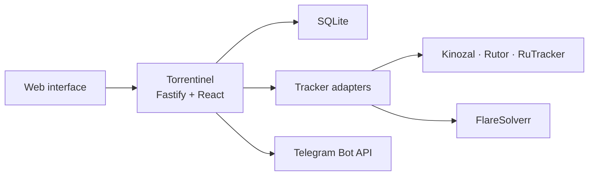

<p align="center">
  
</p>

<p align="center">
  A private, self-hosted monitor for torrent release changes.
</p>

<p align="center">
  <a href="LICENSE"></a>
  <a href="https://hub.docker.com/r/bah0/torrentinel"></a>
  <a href="https://github.com/ib0ndar/Torrentinel/releases"></a>
</p>

Torrentinel watches torrent releases and tells you when something changes. It supports direct-link subscriptions, phrase-based rules, personal collections, and Telegram notifications through a responsive web interface.

## Features

- Direct-link monitoring for title, cover, magnet, torrent-file, and metadata changes
- Case-insensitive rule subscriptions with required and ignored phrases
- Per-user collections, history, and read/unread state
- Telegram notifications with artwork and release links
- Persistent cover fallback when an image host is temporarily unavailable
- Tracker credentials, mirrors, and Telegram bots configured from the web interface
- Administrator-managed accounts with no public registration
- Configurable polling from 5 minutes to 6 hours
- Persistent RuTracker feed buffering with overlap monitoring and authenticated gap recovery
- Tracker diagnostics with seven-day log retention
- Encrypted credentials and bot tokens in SQLite
- Modular TypeScript tracker adapters
- Multi-architecture images for `linux/amd64` and `linux/arm64`

## Screenshots

### Monitor


### Subscription details


### Administration


## Supported trackers

| Tracker | Direct links | Rules | Login |
| --- | --- | --- | --- |
| [Kinozal](https://kinozal.tv/) | Yes | Yes | Required |
| [Rutor](https://rutor.is/) | Yes | Yes | No |
| [RuTracker](https://rutracker.org/) | Yes | Yes | Optional |

## Installation

Torrentinel can run directly as a Node.js service or as a container. Docker Compose and Podman include a private FlareSolverr sidecar. A native installation can use the same RuTracker features when FlareSolverr supports the host architecture and is installed separately.

| Method | Best for | RuTracker detail pages and gap recovery | Host requirements |
| --- | --- | --- | --- |
| [Native Linux](#native-linux) | Minimal overhead and direct service integration | Available with a separate local FlareSolverr service | Node.js 22.20+, npm, a service manager |
| [Docker Compose](#docker-compose) | The shortest complete installation | Included | Docker Engine and Compose v2 |
| [Podman Quadlet](#podman-quadlet) | Rootless, systemd-managed containers | Included | Podman with Quadlet, systemd user services, cgroup v2 |

All methods require Git and `curl`, plus outbound HTTPS access to the configured trackers and Telegram when notifications are enabled. Choose the final HTTP port and `PUBLIC_URL` before linking Telegram or placing Torrentinel behind a reverse proxy.

### Native Linux

Install a system-wide Node.js 22.20 or newer release, npm, and Git using the method recommended by your Linux distribution. Python 3, `make`, and a C/C++ compiler may also be required when npm cannot use a prebuilt native module. Confirm the runtime before continuing:

```sh
node --version
npm --version
git --version
```

Create a dedicated system account named `torrentinel` with your distribution's account-management tool. The account does not need an interactive shell. Then build the tagged release as a regular user:

```sh
git clone https://github.com/ib0ndar/Torrentinel.git
cd Torrentinel
git checkout v0.4.2
npm ci
npm run build
npm prune --omit=dev
```

Install the built application, persistent directories, environment file, and supplied systemd unit:

```sh
sudo install -d -m 0755 /opt/torrentinel
sudo cp -a dist node_modules package.json package-lock.json /opt/torrentinel/
sudo install -d -o torrentinel -g torrentinel -m 0750 \
  /var/lib/torrentinel/database \
  /var/lib/torrentinel/application
sudo install -d -m 0755 /etc/torrentinel
sudo install -o root -g torrentinel -m 0640 \
  deploy/native/torrentinel.env \
  /etc/torrentinel/torrentinel.env
sudo install -o root -g root -m 0644 \
  deploy/native/torrentinel.service \
  /etc/systemd/system/torrentinel.service
```

Edit `/etc/torrentinel/torrentinel.env`. Set `PUBLIC_URL` to the address users will open. The supplied configuration binds to `127.0.0.1`; set `HOST=0.0.0.0` only when the application should accept connections directly from the network.

Start Torrentinel and verify it locally:

```sh
sudo systemctl daemon-reload
sudo systemctl enable --now torrentinel.service
sudo systemctl status torrentinel.service --no-pager
curl -fsS http://127.0.0.1:8080/api/health
```

Public RuTracker feed monitoring works without FlareSolverr. RuTracker detail-page monitoring and authenticated recovery require a separate FlareSolverr service listening only on `127.0.0.1:8191`. Follow the upstream [FlareSolverr native Linux instructions](https://github.com/FlareSolverr/FlareSolverr#precompiled-binaries), keep it inaccessible from the public network, and confirm its address matches `FLARESOLVERR_URL`.

Native service logs are available through the journal:

```sh
sudo journalctl -u torrentinel.service -f
```

If the host does not use systemd, run `/usr/bin/env node /opt/torrentinel/dist/server/index.js` under its service manager with the variables from `deploy/native/torrentinel.env` and write access to both `/var/lib/torrentinel` subdirectories.

### Docker Compose

Docker Compose runs Torrentinel and FlareSolverr on a private container network and stores persistent data in two named volumes.

```sh
git clone https://github.com/ib0ndar/Torrentinel.git
cd Torrentinel
git checkout v0.4.2
cp .env.example .env
```

Edit `.env`, especially `PUBLIC_URL`, `TORRENTINEL_PORT`, and `SESSION_COOKIE_SECURE`. Then validate and start the deployment:

```sh
docker compose config
docker compose pull
docker compose up -d
docker compose ps
curl -fsS http://127.0.0.1:8080/api/health
```

If `TORRENTINEL_PORT` is changed, use that port in the health-check URL. View application and resolver logs with:

```sh
docker compose logs -f torrentinel
docker compose logs -f flaresolverr
```

Running only the Torrentinel image is supported for advanced deployments, but RuTracker detail pages and authenticated feed-gap recovery remain unavailable until a FlareSolverr service is connected through `FLARESOLVERR_URL`.

### Podman Quadlet

The supplied Quadlets run both containers rootlessly under the current user's systemd manager. They are not specific to one Linux distribution, but they require Quadlet support and cgroup v2:

```sh
podman --version
podman info --format '{{.Host.CgroupsVersion}}'
systemctl --user --version
```

The cgroup command must report `v2`. Install the tagged deployment files and create a private local environment file:

```sh
git clone https://github.com/ib0ndar/Torrentinel.git
cd Torrentinel
git checkout v0.4.2
install -d -m 0700 "$HOME/.config/containers/systemd"
install -m 0644 \
  deploy/*.container deploy/*.network deploy/*.volume \
  "$HOME/.config/containers/systemd/"
install -m 0600 \
  deploy/torrentinel.env.example \
  "$HOME/.config/containers/systemd/torrentinel.env"
```

Edit `~/.config/containers/systemd/torrentinel.env`, particularly `PUBLIC_URL` and `SESSION_COOKIE_SECURE`. The supplied Quadlet publishes TCP port `8999`. Pre-pull the images so the first service start is predictable, enable the user manager at boot, and start Torrentinel:

```sh
podman pull docker.io/bah0/torrentinel:v0.4.2
podman pull ghcr.io/flaresolverr/flaresolverr:v3.5.0
sudo loginctl enable-linger "$USER"
systemctl --user daemon-reload
systemctl --user start torrentinel.service
systemctl --user status torrentinel.service --no-pager
curl -fsS http://127.0.0.1:8999/api/health
```

The `.volume` Quadlets create `torrentinel_app` and `torrentinel_db` automatically. View logs with:

```sh
journalctl --user -u torrentinel.service -f
journalctl --user -u torrentinel_flaresolverr.service -f
```

If systemd does not generate `torrentinel.service`, inspect the Quadlet syntax and generator errors:

```sh
systemd-analyze --user --generators=true verify torrentinel.service
```

### First sign-in

Open the configured URL and sign in with:

```text
Username: admin
Password: admin
```

Torrentinel requires the default password to be changed immediately. Configure tracker accounts, mirrors, and Telegram bots under **Settings**. Manage users and the polling interval under **Administration**.

Do not expose a new installation to an untrusted network until the default administrator password has been changed.

## Configuration

A RuTracker login is optional for ordinary public-feed monitoring and required for authenticated recovery after a detected feed gap. The configured polling interval is the actual tracker request interval. Administration displays the rolling-feed window, consecutive-batch overlap, new-entry count, and safety margin.

Runtime settings are read from the process environment. Native systemd uses `/etc/torrentinel/torrentinel.env`, Docker Compose uses `.env`, and Podman uses `~/.config/containers/systemd/torrentinel.env`.

| Variable | Native configuration | Container configuration | Description |
| --- | --- | --- | --- |
| `HOST` | `127.0.0.1` | `0.0.0.0` | HTTP listen address |
| `PORT` | `8080` | `8080` | Application HTTP port |
| `PUBLIC_URL` | `http://localhost:8080` | Deployment-specific | Externally reachable URL without a trailing slash |
| `DATA_DIR` | `/var/lib/torrentinel/database` | `/data` | SQLite database directory |
| `APP_DATA_DIR` | `/var/lib/torrentinel/application` | `/var/lib/torrentinel` | Encryption key and cached-cover directory |
| `POLL_INTERVAL_MINUTES` | `60` | `60` | Initial interval before an administrator saves a value |
| `POLL_STARTUP_DELAY_SECONDS` | `20` | `20` | Delay before the startup poll |
| `TRACKER_REQUEST_TIMEOUT_MS` | `30000` | `30000` | Tracker HTTP timeout |
| `FLARESOLVERR_URL` | `http://127.0.0.1:8191/v1` | Private sidecar URL | FlareSolverr API address |
| `FLARESOLVERR_TIMEOUT_MS` | `120000` | `120000` | Browser resolver timeout |
| `SESSION_DAYS` | `30` | `30` | Login-session lifetime |
| `SESSION_COOKIE_SECURE` | `false` | `false` | Set to `true` when the public URL uses HTTPS |

Tracker passwords and Telegram tokens are configured only in the web interface and are never environment variables.

### Reverse proxy and HTTPS

When a reverse proxy terminates HTTPS, point it at Torrentinel's host port, set `PUBLIC_URL` to the final `https://` address, and set `SESSION_COOKIE_SECURE=true`. The native service binds to loopback by default and is ready for this arrangement. Container ports bind on the host, so restrict them with the host firewall when only the reverse proxy should have access. FlareSolverr must remain on its private network or loopback address and must never be routed through the public proxy.

## Operating Torrentinel

### Health and status

The unauthenticated health endpoint returns database and scheduler status:

```sh
curl -fsS http://127.0.0.1:8080/api/health
```

Use port `8999` for the supplied Podman deployment or the selected `TORRENTINEL_PORT` for Docker Compose. Service status is available with `systemctl`, `docker compose ps`, or `systemctl --user` respectively.

### Updating

Back up both persistent data locations before every update. For a native installation, fetch and build the new tag, stop the service, replace the four installed application paths, and restart:

```sh
RELEASE=v0.4.2
git fetch --tags
git checkout "$RELEASE"
npm ci
npm run build
npm prune --omit=dev
sudo systemctl stop torrentinel.service
sudo cp -a dist node_modules package.json package-lock.json /opt/torrentinel/
sudo systemctl start torrentinel.service
curl -fsS http://127.0.0.1:8080/api/health
```

For Docker Compose, check out the new release so `compose.yaml` contains its pinned image tag:

```sh
RELEASE=v0.4.2
git fetch --tags
git checkout "$RELEASE"
docker compose pull
docker compose up -d
docker compose ps
```

For Podman, install the updated declarative units without overwriting the local environment file:

```sh
RELEASE=v0.4.2
git fetch --tags
git checkout "$RELEASE"
install -m 0644 \
  deploy/*.container deploy/*.network deploy/*.volume \
  "$HOME/.config/containers/systemd/"
podman pull docker.io/bah0/torrentinel:v0.4.2
systemctl --user daemon-reload
systemctl --user restart torrentinel.service
systemctl --user status torrentinel.service --no-pager
```

Replace `RELEASE` and the Podman image tag with the version being installed.

### Troubleshooting

- A failed health request should be followed by the service logs for the selected deployment method.
- For native file-permission failures, confirm the `torrentinel` account can write to both `/var/lib/torrentinel/database` and `/var/lib/torrentinel/application`.
- A vault-key mismatch means the database and application-key directory came from different backups. Restore them as a pair.
- RuTracker detail or recovery failures should be checked against the FlareSolverr logs. Never publish port `8191` to the internet.
- A missing Podman service usually means the Quadlet generator rejected an option; run the `systemd-analyze` command shown above.

## Telegram notifications

Each Torrentinel user can connect a separate Telegram bot and account:

1. Create a bot with Telegram's [BotFather](https://t.me/BotFather).
2. Save the bot token in Torrentinel under **Settings**.
3. Generate a linking code and send the displayed `/start` command to the bot.

`PUBLIC_URL` must be reachable from the Telegram client for Torrentinel-hosted Magnet buttons to work.

## Architecture



The API, React interface, scheduler, Telegram worker, and SQLite database run in one Node.js process, either directly on Linux or inside a container. Tracker-specific behavior is isolated behind shared direct-subscription and rule-discovery contracts under `server/trackers/plugins/`.

## Data and backups

Torrentinel keeps its SQLite database separately from its generated encryption key and cached covers:

| Deployment | Database | Encryption key and covers |
| --- | --- | --- |
| Native Linux | `/var/lib/torrentinel/database` | `/var/lib/torrentinel/application` |
| Docker Compose | `torrentinel_db` volume | `torrentinel_app` volume |
| Podman Quadlet | `torrentinel_db` volume | `torrentinel_app` volume |

Tracker passwords and Telegram bot tokens are encrypted with AES-256-GCM before being stored. Always stop Torrentinel and back up both locations together. A database restored without its matching key cannot decrypt saved integrations.

For a native installation:

```sh
sudo systemctl stop torrentinel.service
sudo tar -C /var/lib/torrentinel -czf \
  "$PWD/torrentinel-backup-$(date +%F).tar.gz" \
  database application
sudo systemctl start torrentinel.service
```

For Docker Compose, copy both paths from the stopped application container:

```sh
backup_dir="torrentinel-backup-$(date +%F)"
install -d -m 0700 "$backup_dir"
docker compose stop torrentinel
docker cp torrentinel:/data "$backup_dir/database"
docker cp torrentinel:/var/lib/torrentinel "$backup_dir/application"
docker compose start torrentinel
tar -czf "$backup_dir.tar.gz" "$backup_dir"
```

For Podman, stop the generated service and export both named volumes:

```sh
backup_dir="torrentinel-backup-$(date +%F)"
install -d -m 0700 "$backup_dir"
systemctl --user stop torrentinel.service
podman volume export -o "$backup_dir/database.tar" torrentinel_db
podman volume export -o "$backup_dir/application.tar" torrentinel_app
systemctl --user start torrentinel.service
tar -czf "$backup_dir.tar.gz" "$backup_dir"
```

To restore, stop the application, replace both persistent locations from the same archive, preserve their ownership and permissions, and then start the service. Keep the original data until the restored health check and saved integrations have been verified.

## Development

Torrentinel requires Node.js 22.20 or newer.

```sh
npm ci
npm run dev:server
```

Start the web interface in another terminal:

```sh
npm run dev:web
```

Run the verification suite with:

```sh
npm run typecheck
npm test
npm run build
```

## Adding a tracker

Each tracker integration declares its capabilities and implements the applicable direct, rule, authentication, parsing, and transport modules. New adapters are registered in `server/trackers/index.ts` and should include contract tests for their supported operations.

## AI assistance

Torrentinel was created with assistance from GPT models by [OpenAI](https://openai.com/). The generated code was reviewed, tested, and integrated by the project maintainer.

## License

Torrentinel is available under the [GNU Affero General Public License v3.0](LICENSE).
