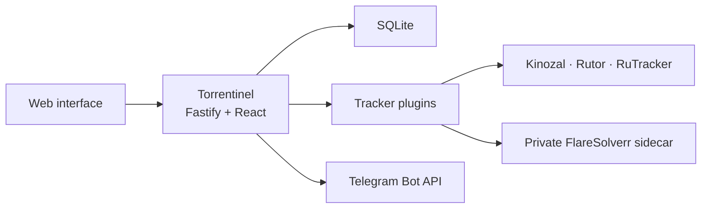

<p align="center">
  
</p>

<p align="center">
  A private, self-hosted sentinel for torrent release changes.
</p>

<p align="center">
  <a href="LICENSE"></a>
  
  
</p>

Torrentinel watches selected torrent trackers for new releases and changes. It combines direct-link monitoring, phrase-based rules, per-user collections, a responsive web interface, and private Telegram notifications in a small self-hosted deployment.

Torrentinel does not host, index, or download copyrighted material. Use it only with trackers and content you are legally permitted to access.

## Features

- Direct-link subscriptions that monitor titles, covers, magnet links, torrent-file links, and tracker metadata.
- Rule subscriptions with case-insensitive required and ignored phrases.
- A silent first baseline, preventing existing releases from creating an initial notification storm.
- Separate collections, subscriptions, read state, and history for every user.
- Admin-managed accounts with no public registration and no captcha.
- Read, unread, updated, and error markers in the web interface.
- Per-user tracker credentials and custom mirrors.
- Per-user Telegram bots linked through short-lived `/start` codes.
- Rich Telegram notifications with cover art, release details, tracker and Magnet/Torrent file buttons.
- Configurable polling from 5 minutes to 6 hours.
- Administrator tracker logs with a fixed 168-hour rolling retention window.
- AES-256-GCM encryption for tracker credentials and Telegram bot tokens stored in SQLite.
- Native TypeScript tracker plugins designed for future extension.
- Rootless Podman deployment with two persistent named volumes.

## Screenshots

These screenshots use fictional demo subscriptions and contain no production account data.

### Monitor workspace


### Subscription details


### Administration and tracker diagnostics


## Supported trackers

| Tracker | Direct links | Rules | Authentication | Rule source |
| --- | --- | --- | --- | --- |
| [Kinozal](https://kinozal.tv/) | Yes | Yes | Required | Recent releases |
| [Rutor](https://rutor.is/) | Yes | Yes | None | Recent releases |
| [RuTracker](https://rutracker.org/) | Yes | Yes | Optional | Rolling Atom feed |

Tracker sites can change their HTML, authentication, or anti-bot protection without notice. Torrentinel reports parser and access failures in the interface instead of silently treating a failed check as an unchanged release.

## Diagnostics and log retention

Administrators can inspect **Tracker logs** in the Administration page. Torrentinel records scheduler runs and safe tracker observations, including the tracker, operation, outcome, duration, HTTP status, requested and resolved URLs, external ID, title, fingerprint, discovered-release counts, and sanitized error details.

Diagnostic records have a fixed rolling retention of **168 hours (7 days)**. Expired records are removed at application startup, after scheduler runs, when the administrator reads the log, and by a periodic cleanup while the service is running.

The diagnostic log deliberately does not store tracker credentials, cookies, Telegram bot tokens, magnet URIs, torrent-file payloads or download URLs, or raw tracker HTML. URLs have user information, fragments, and sensitive query parameters removed or redacted before storage.

## How it works



The Fastify API, React interface, scheduler, Telegram long-poller, and SQLite database share one Node.js application container. A private FlareSolverr sidecar resolves Cloudflare-protected RuTracker detail pages. Its port is not published and it does not require persistent storage.

Tracker adapters live under `server/trackers/plugins/`. Each plugin declares its capabilities and may implement:

- `direct`: normalize a tracker URL and return a stable release snapshot;
- `rules`: discover recent releases from a feed, list, or search source;
- authentication, custom-mirror, artwork, and snapshot-version behavior.

The scheduler consumes only these shared contracts, keeping collections, baselines, change events, and notifications independent of individual tracker implementations.

## Quick start with Podman

Requirements:

- Podman 5 or newer;
- outbound network access from the containers;
- enough shared memory for the browser sidecar.

Build the image and create the network and two persistent volumes:

```sh
podman build --format docker -t localhost/torrentinel:local .
podman network create torrentinel_internal
podman volume create torrentinel_app
podman volume create torrentinel_db
```

Start the private browser resolver:

```sh
podman run -d \
  --name torrentinel_flaresolverr \
  --restart=unless-stopped \
  --network torrentinel_internal \
  --network-alias flaresolverr \
  --shm-size 512m \
  --tmpfs /config:rw,size=64m,mode=0700 \
  -e LOG_LEVEL=info \
  ghcr.io/flaresolverr/flaresolverr:v3.5.0
```

Start Torrentinel:

```sh
podman run -d \
  --name torrentinel \
  --restart=unless-stopped \
  --network torrentinel_internal \
  -p 8080:8080 \
  -v torrentinel_app:/var/lib/torrentinel:Z,U \
  -v torrentinel_db:/data:Z,U \
  -e FLARESOLVERR_URL=http://flaresolverr:8191/v1 \
  -e PUBLIC_URL=http://localhost:8080 \
  localhost/torrentinel:local
```

Open [http://localhost:8080](http://localhost:8080) and sign in with the initial account:

```text
Username: admin
Password: admin
```

Torrentinel requires the default password to be changed immediately after the first sign-in. Tracker credentials, mirrors, and Telegram integration are then configured in **Settings**.

For Telegram Magnet buttons, `PUBLIC_URL` must be an HTTP or HTTPS address through which the user's Telegram client can reach Torrentinel. Use the externally reachable reverse-proxy URL instead of `localhost` in a production deployment.

## Rootless Podman on RHEL

The `deploy/` directory contains Quadlet files for a rootless RHEL deployment. The supplied example uses:

- application container name `torrentinel`;
- host TCP port `8999`, mapped to container port `8080`;
- named volumes `torrentinel_app` and `torrentinel_db`;
- an internal network and unpublished FlareSolverr sidecar;
- `keep-id` user mapping, SELinux relabeling, health checks, and automatic restart.

Build the expected image and install the units:

```sh
podman build --format docker -t localhost/torrentinel:latest .
podman volume create torrentinel_app
podman volume create torrentinel_db

install -d -m 0700 ~/.config/containers/systemd
install -m 0644 \
  deploy/torrentinel.container \
  deploy/torrentinel.network \
  deploy/torrentinel_flaresolverr.container \
  ~/.config/containers/systemd/

sudo loginctl enable-linger "$USER"
systemctl --user daemon-reload
systemctl --user start torrentinel.service
```

Before using Telegram Magnet buttons, replace the example `PUBLIC_URL` in `deploy/torrentinel.container` with an address reachable from the Telegram client.

Useful commands:

```sh
systemctl --user status torrentinel.service
systemctl --user restart torrentinel.service
journalctl --user-unit torrentinel.service -f
podman healthcheck run torrentinel
```

## Configuration

| Variable | Default | Purpose |
| --- | --- | --- |
| `PORT` | `8080` | HTTP port inside the container |
| `PUBLIC_URL` | unset | Browser-reachable base URL used for Telegram Magnet buttons |
| `DATA_DIR` | `/data` | Directory containing the SQLite database |
| `APP_DATA_DIR` | `/var/lib/torrentinel` | Directory containing the encryption key |
| `POLL_INTERVAL_MINUTES` | `60` | Initial polling interval; the admin interface accepts 5–360 minutes |
| `POLL_STARTUP_DELAY_SECONDS` | `20` | Delay before the first automatic poll |
| `TRACKER_REQUEST_TIMEOUT_MS` | `30000` | Tracker HTTP request timeout |
| `FLARESOLVERR_URL` | `http://127.0.0.1:8191/v1` | Internal resolver API for RuTracker detail pages |
| `FLARESOLVERR_TIMEOUT_MS` | `120000` | Browser-resolved detail request timeout |
| `SESSION_DAYS` | `30` | Web-session lifetime |
| `SESSION_COOKIE_SECURE` | `false` | Set to `true` when the service is available exclusively through HTTPS |

Copy `.env.example` when running the application outside a container. Tracker passwords and Telegram bot tokens are deliberately not environment variables; users enter them through the authenticated interface.

## Data and security

Torrentinel stores its generated encryption key and SQLite database separately:

- application volume: `/var/lib/torrentinel`, containing the 256-bit encryption key;
- database volume: `/data`, containing SQLite and its WAL files.

Tracker usernames, tracker passwords, and Telegram bot tokens are encrypted with AES-256-GCM before being written to SQLite. The key is created on first start with file mode `0600` and is never returned by the API.

Back up both volumes together. Losing the application volume makes encrypted integration data in the database unrecoverable. Stop the application before a raw volume-level backup so the SQLite database and WAL remain consistent.

Recommended production practices:

- place Torrentinel behind an HTTPS reverse proxy;
- set `SESSION_COOKIE_SECURE=true`;
- replace `admin` / `admin` immediately when prompted;
- do not publish the FlareSolverr port;
- restrict access to the web interface at the network or proxy layer;
- never commit `.env`, database, key, or backup files.

## Development

Install dependencies and start the API:

```sh
npm ci
npm run dev:server
```

Start the Vite development server in another terminal:

```sh
npm run dev:web
```

Verification commands:

```sh
npm run typecheck
npm test
npm run build
npm audit
```

## Adding a tracker

1. Add the tracker key and default mirror to the application types and database seed data.
2. Create `server/trackers/plugins/<tracker>/manifest.ts`.
3. Implement the applicable direct, rules, parser, authentication, and transport modules.
4. Register the plugin factory in `server/trackers/index.ts`.
5. Add sanitized HTML or XML fixtures and contract tests.
6. Increment `snapshotVersion` whenever the persisted snapshot schema changes.

Existing subscriptions are silently re-baselined after a snapshot schema change, preventing deployments from generating false update events.

## Project status

Torrentinel is an early self-hosted project. Tracker integrations depend on third-party sites and may require maintenance when those sites change. Issues and pull requests containing sanitized fixtures are welcome; never include tracker cookies, credentials, bot tokens, personal subscription data, or copyrighted torrent payloads.

## AI assistance

This project was created with assistance from GPT models by [OpenAI](https://openai.com/). The project maintainer reviewed, tested, and integrated the resulting code.

## License

Torrentinel is licensed under the [GNU Affero General Public License v3.0](LICENSE), SPDX identifier `AGPL-3.0-only`.

If you modify Torrentinel and make it available to users over a network, review the source-availability requirements in section 13 of the license.
