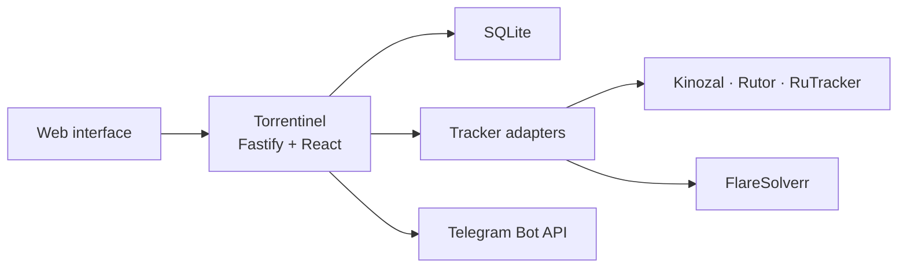

<p align="center">
  <picture>
    <source media="(prefers-color-scheme: dark)" srcset="https://raw.githubusercontent.com/ib0ndar/Torrentinel/main/public/brand/torrentinel-lockup.svg">
    <source media="(prefers-color-scheme: light)" srcset="https://raw.githubusercontent.com/ib0ndar/Torrentinel/main/public/brand/torrentinel-lockup-light.svg">
    
  </picture>
</p>

<p align="center">
  A private, self-hosted monitor for torrent release changes.
</p>

<p align="center">
  <a href="LICENSE"></a>
  <a href="https://github.com/ib0ndar/Torrentinel/actions/workflows/ci.yml"></a>
  <a href="https://hub.docker.com/r/bah0/torrentinel"></a>
  <a href="https://github.com/ib0ndar/Torrentinel/releases"></a>
</p>

Torrentinel is a self-hosted watchlist and change-detection service. It monitors selected tracker releases, detects changes to titles, artwork, magnets, torrent files, and metadata, discovers new phrase matches, keeps per-user history, and sends Telegram notifications.

## Why Torrentinel?

Torrentinel is designed for people who want to follow releases over time, including changes to an existing tracker topic. It complements download clients and media automation rather than replacing them.

| Use Torrentinel when you want to | Choose another tool when you primarily want to |
| --- | --- |
| Watch specific tracker pages for later changes | Send matching releases automatically to a download client |
| Discover new posts matching simple required and ignored phrases | Manage a large catalogue of indexers or Usenet providers |
| Keep private per-user collections, history, and read state | Manage a movie, television, or music library |
| Receive Telegram notifications without connecting a download client | React to real-time IRC announces or build a general automation pipeline |

## Quick start with Docker Compose

This is the shortest complete deployment and includes the private FlareSolverr sidecar used for RuTracker detail pages and authenticated feed-gap recovery.

The first two commands ask GitHub for the latest stable release tag automatically and store it in `RELEASE`; there is no version number to replace manually.

```sh
release_url="$(curl -fsSL -o /dev/null -w '%{url_effective}' \
  https://github.com/ib0ndar/Torrentinel/releases/latest)"
RELEASE="${release_url##*/}"
git clone --branch "$RELEASE" --depth 1 https://github.com/ib0ndar/Torrentinel.git
cd Torrentinel
cp .env.example .env
# Edit .env now if the public URL or host port will differ.
docker compose config
docker compose up -d
curl -fsS http://127.0.0.1:8080/api/health
```

Open the configured URL and complete the [first sign-in](#first-sign-in).

## Contents

- [Features](#features)
- [Screenshots](#screenshots)
- [Supported trackers](#supported-trackers)
- [Project status and platform scope](#project-status-and-platform-scope)
- [Installation](#installation)
  - [Direct installation on Linux](#direct-installation-on-linux)
  - [Docker Compose](#docker-compose)
  - [Podman Quadlet](#podman-quadlet)
- [Configuration](#configuration)
- [Operations and backups](#operations-and-backups)
- [Development and contributing](#development-and-contributing)
- [Responsible use and license](#responsible-use-and-license)

## Features

- Direct-link monitoring for title, cover, magnet, torrent-file, and metadata changes
- Case-insensitive rule subscriptions with required and ignored phrases
- Per-user collections, history, and read/unread state
- Telegram notifications with artwork and release links
- Persistent cover fallback when an image host is temporarily unavailable
- Tracker credentials, mirrors, and Telegram bots configured from the web interface
- Administrator-managed accounts with no public registration
- Configurable polling from 5 minutes to 6 hours
- Persistent RuTracker feed buffering with overlap monitoring and authenticated gap recovery
- Tracker diagnostics with seven-day log retention
- Encrypted credentials and bot tokens in SQLite
- Modular TypeScript tracker adapters
- Multi-architecture images for `linux/amd64` and `linux/arm64`

## Screenshots

### Monitor


### Subscription details


### Administration


## Supported trackers

| Tracker | Direct links | Rules | Login |
| --- | --- | --- | --- |
| [Kinozal](https://kinozal.tv/) | Yes | Yes | Required |
| [Rutor](https://rutor.is/) | Yes | Yes | No |
| [RuTracker](https://rutracker.org/) | Yes | Yes | Optional |

## Project status and platform scope

Torrentinel is pre-1.0 software. Releases may change configuration, tracker behavior, or database structure. Database migrations run automatically at startup, but rollback is not guaranteed; read the [changelog](CHANGELOG.md) and create a paired backup before every update.

Direct installation on a Linux host is supported with Node.js 22.20 or newer. The supplied systemd unit is the maintained service definition for this deployment method. Container images target Linux on `amd64` and `arm64`; Docker Desktop may run those images, but macOS and Windows hosts are not part of the maintained deployment test matrix.

Torrentinel does not claim a fixed CPU or RAM minimum because tracker activity and FlareSolverr use vary. FlareSolverr starts a headless browser and is the heaviest component; the supplied container definitions provide it with 512 MiB of shared memory. Small hosts should monitor memory during RuTracker detail and recovery operations.

## Installation

Torrentinel can be installed directly on a Linux host as a Node.js service, without Docker, Podman, or another container runtime. It can also run as a container. Docker Compose and Podman include a private FlareSolverr sidecar. A direct installation can use the same RuTracker features when FlareSolverr supports the host architecture and is installed separately.

| Method | Best for | RuTracker detail pages and gap recovery | Host requirements |
| --- | --- | --- | --- |
| [Direct Linux installation](#direct-installation-on-linux) | Minimal overhead and direct service integration | Available with a separate local FlareSolverr service | Node.js 22.20+, npm, a service manager |
| [Docker Compose](#docker-compose) | The shortest complete installation | Included | Docker Engine and Compose v2 |
| [Podman Quadlet](#podman-quadlet) | Rootless, systemd-managed containers | Included | Podman with Quadlet, systemd user services, cgroup v2 |

All methods require Git and `curl`, plus outbound HTTPS access to the configured trackers and Telegram when notifications are enabled. Each example resolves GitHub's latest stable release when you run it and uses that same tag for the remaining commands. Choose the final HTTP port and `PUBLIC_URL` before linking Telegram or placing Torrentinel behind a reverse proxy.

### Direct installation on Linux

Install a system-wide Node.js 22.20 or newer release, npm, and Git using the method recommended by your Linux distribution. Python 3, `make`, and a C/C++ compiler may also be required when npm cannot use a prebuilt native module. Confirm the runtime before continuing:

```sh
node --version
npm --version
git --version
```

Create a dedicated system account named `torrentinel` with your distribution's account-management tool. The account does not need an interactive shell. Build on the target host, or on a Linux system with the same architecture, libc, and Node.js ABI:

```sh
release_url="$(curl -fsSL -o /dev/null -w '%{url_effective}' \
  https://github.com/ib0ndar/Torrentinel/releases/latest)"
RELEASE="${release_url##*/}"
git clone --branch "$RELEASE" --depth 1 https://github.com/ib0ndar/Torrentinel.git
cd Torrentinel
npm ci
npm run build
npm prune --omit=dev
```

Install the built application, persistent directories, environment file, and supplied systemd unit:

```sh
sudo install -d -m 0755 /opt/torrentinel
sudo cp -a dist node_modules package.json package-lock.json /opt/torrentinel/
sudo install -d -o torrentinel -g torrentinel -m 0750 \
  /var/lib/torrentinel/database \
  /var/lib/torrentinel/application
sudo install -d -m 0755 /etc/torrentinel
sudo install -o root -g torrentinel -m 0640 \
  deploy/native/torrentinel.env \
  /etc/torrentinel/torrentinel.env
sudo install -o root -g root -m 0644 \
  deploy/native/torrentinel.service \
  /etc/systemd/system/torrentinel.service
```

Edit `/etc/torrentinel/torrentinel.env`. Set `PUBLIC_URL` to the address users will open. The supplied configuration binds to `127.0.0.1`; set `HOST=0.0.0.0` only when the application should accept connections directly from the network.

Start Torrentinel and verify it locally:

```sh
sudo systemctl daemon-reload
sudo systemctl enable --now torrentinel.service
sudo systemctl status torrentinel.service --no-pager
curl -fsS http://127.0.0.1:8080/api/health
```

Public RuTracker feed monitoring works without FlareSolverr. RuTracker detail-page monitoring and authenticated recovery require a separate FlareSolverr service listening only on `127.0.0.1:8191`. Follow the upstream [FlareSolverr instructions for precompiled Linux binaries](https://github.com/FlareSolverr/FlareSolverr#precompiled-binaries) and confirm its address matches `FLARESOLVERR_URL`.

> [!WARNING]
> FlareSolverr provides a browser-control API without Torrentinel authentication. Keep it on loopback or a private container network and never expose port `8191` publicly.

If the host does not use systemd, run `/usr/bin/env node /opt/torrentinel/dist/server/index.js` under its service manager with the variables from `deploy/native/torrentinel.env` and write access to both `/var/lib/torrentinel` subdirectories.

### Docker Compose

Docker Compose runs Torrentinel and FlareSolverr on a private container network and stores persistent data in two named volumes.

```sh
release_url="$(curl -fsSL -o /dev/null -w '%{url_effective}' \
  https://github.com/ib0ndar/Torrentinel/releases/latest)"
RELEASE="${release_url##*/}"
git clone --branch "$RELEASE" --depth 1 https://github.com/ib0ndar/Torrentinel.git
cd Torrentinel
cp .env.example .env
```

Edit `.env`, especially `PUBLIC_URL`, `TORRENTINEL_PORT`, and `SESSION_COOKIE_SECURE`. Then validate and start the deployment:

```sh
docker compose config
docker compose pull
docker compose up -d
docker compose ps
curl -fsS http://127.0.0.1:8080/api/health
```

If `TORRENTINEL_PORT` is changed, use that port in the health-check URL. View logs with the commands in the [operations guide](docs/operations.md#logs).

Running only the Torrentinel image is supported for advanced deployments, but RuTracker detail pages and authenticated feed-gap recovery remain unavailable until a FlareSolverr service is connected through `FLARESOLVERR_URL`.

### Podman Quadlet

The supplied Quadlets run both containers rootlessly under the current user's systemd manager. They are not specific to one Linux distribution, but they require Quadlet support and cgroup v2:

```sh
podman --version
podman info --format '{{.Host.CgroupsVersion}}'
systemctl --user --version
```

The cgroup command must report `v2`. Install the tagged deployment files and create a private local environment file:

```sh
release_url="$(curl -fsSL -o /dev/null -w '%{url_effective}' \
  https://github.com/ib0ndar/Torrentinel/releases/latest)"
RELEASE="${release_url##*/}"
git clone --branch "$RELEASE" --depth 1 https://github.com/ib0ndar/Torrentinel.git
cd Torrentinel
install -d -m 0700 "$HOME/.config/containers/systemd"
install -m 0644 \
  deploy/*.container deploy/*.network deploy/*.volume \
  "$HOME/.config/containers/systemd/"
install -m 0600 \
  deploy/torrentinel.env.example \
  "$HOME/.config/containers/systemd/torrentinel.env"
```

Edit `~/.config/containers/systemd/torrentinel.env`, particularly `PUBLIC_URL` and `SESSION_COOKIE_SECURE`. The supplied Quadlet publishes TCP port `8999`. Pre-pull the images so the first service start is predictable, enable the user manager at boot, and start Torrentinel:

```sh
podman pull "docker.io/bah0/torrentinel:$RELEASE"
podman pull ghcr.io/flaresolverr/flaresolverr:v3.5.0
sudo loginctl enable-linger "$USER"
systemctl --user daemon-reload
systemctl --user start torrentinel.service
systemctl --user status torrentinel.service --no-pager
curl -fsS http://127.0.0.1:8999/api/health
```

The `.volume` Quadlets create `torrentinel_app` and `torrentinel_db` automatically. If systemd does not generate `torrentinel.service`, follow the [Podman troubleshooting guidance](docs/operations.md#troubleshooting).

### First sign-in

Open the configured URL and sign in with:

```text
Username: admin
Password: admin
```

Torrentinel requires the default password to be changed immediately. Configure tracker accounts, mirrors, and Telegram bots under **Settings**. Manage users and the polling interval under **Administration**.

Do not expose a new installation to an untrusted network until the default administrator password has been changed.

## Configuration

A RuTracker login is optional for ordinary public-feed monitoring and required for authenticated recovery after a detected feed gap. The configured polling interval is the actual tracker request interval. Administration displays the rolling-feed window, consecutive-batch overlap, new-entry count, and safety margin.

Runtime settings are read from the process environment. The direct systemd installation uses `/etc/torrentinel/torrentinel.env`, Docker Compose uses `.env`, and Podman uses `~/.config/containers/systemd/torrentinel.env`.

| Setting | Direct Linux installation | Docker Compose | Podman Quadlet | Purpose |
| --- | --- | --- | --- | --- |
| `HOST` | `127.0.0.1`, editable | Fixed to image default `0.0.0.0` | Fixed to image default `0.0.0.0` | Application listen address |
| `PORT` | `8080`, editable | Internal port `8080` | Internal port `8080` | Application container/process port |
| `TORRENTINEL_PORT` | Not used | `8080`, editable | Not used | Docker host port mapped to internal `8080` |
| `PUBLIC_URL` | Editable | Editable | Editable | Externally reachable URL without a trailing slash |
| `DATA_DIR` | `/var/lib/torrentinel/database` | Fixed volume path `/data` | Fixed volume path `/data` | SQLite database directory |
| `APP_DATA_DIR` | `/var/lib/torrentinel/application` | Fixed volume path `/var/lib/torrentinel` | Fixed volume path `/var/lib/torrentinel` | Encryption key and cached-cover directory |
| `POLL_INTERVAL_MINUTES` | Editable, default `60` | Editable, default `60` | Editable, default `60` | Initial interval before an administrator saves a value |
| `POLL_STARTUP_DELAY_SECONDS` | Editable, default `20` | Editable, default `20` | Editable, default `20` | Delay before the startup poll |
| `TRACKER_REQUEST_TIMEOUT_MS` | Editable, default `30000` | Editable, default `30000` | Editable, default `30000` | Tracker HTTP timeout |
| `FLARESOLVERR_URL` | Editable loopback URL | Fixed private sidecar URL | Editable private sidecar URL | FlareSolverr API address |
| `FLARESOLVERR_TIMEOUT_MS` | Editable, default `120000` | Editable, default `120000` | Editable, default `120000` | Browser resolver timeout |
| `SESSION_DAYS` | Editable, default `30` | Editable, default `30` | Editable, default `30` | Login-session lifetime |
| `SESSION_COOKIE_SECURE` | Editable, default `false` | Editable, default `false` | Editable, default `false` | Set to `true` when the public URL uses HTTPS |

The standalone container image accepts all runtime variables directly. The supported Compose and Quadlet definitions intentionally fix their internal listen ports, data paths, and private-network topology; use the documented host-port setting instead of changing container internals.

Tracker passwords and Telegram tokens are configured only in the web interface and are never environment variables.

### Reverse proxy and HTTPS

When a reverse proxy terminates HTTPS, point it at Torrentinel's host port, set `PUBLIC_URL` to the final `https://` address, and set `SESSION_COOKIE_SECURE=true`. The native service binds to loopback by default and is ready for this arrangement. Container ports bind on the host, so restrict them with the host firewall when only the reverse proxy should have access. FlareSolverr must remain on its private network or loopback address and must never be routed through the public proxy.

## Telegram notifications

Each Torrentinel user can connect a separate Telegram bot and account:

1. Create a bot with Telegram's [BotFather](https://t.me/BotFather).
2. Save the bot token in Torrentinel under **Settings**.
3. Generate a linking code and send the displayed `/start` command to the bot.

`PUBLIC_URL` must be reachable from the Telegram client for Torrentinel-hosted Magnet buttons to work.

## Architecture



The API, React interface, scheduler, Telegram worker, and SQLite database run in one Node.js process, either directly on Linux or inside a container. Tracker-specific behavior is isolated behind shared direct-subscription and rule-discovery contracts under `server/trackers/plugins/`.

## Operations and backups

The [operations guide](docs/operations.md) contains health-response details, service and log commands, updates, paired backups, restoration precautions, troubleshooting, and uninstall instructions for all three deployment methods.

> [!IMPORTANT]
> The SQLite database and application-data directory form one backup set. The database contains encrypted integrations, while the matching generated key is stored in application data. Always stop Torrentinel and back up or restore both together.

## Development and contributing

Torrentinel requires Node.js 22.20 or newer.

```sh
npm ci
npm run dev:server
```

Start the web interface in another terminal with `npm run dev:web`. Run the verification suite before submitting changes:

```sh
npm run check:release
npm test
npm run build
```

See [CONTRIBUTING.md](CONTRIBUTING.md) for tracker-adapter conventions, data-handling requirements, and the complete pull-request checks. Report vulnerabilities according to [SECURITY.md](SECURITY.md).

## Responsible use and license

Torrentinel is general-purpose monitoring software. Operators are responsible for ensuring that configured tracker access and use comply with each tracker's rules and with applicable law. Torrentinel does not grant tracker access or permission to collect or redistribute content.

Torrentinel is available under the [GNU Affero General Public License v3.0](LICENSE). If you run a modified version on a network server and allow users to interact with it, the AGPL requires offering those users the corresponding source code for that modified version.

Torrentinel was created with assistance from GPT models by [OpenAI](https://openai.com/). The generated code was reviewed, tested, and integrated by the project maintainer.
