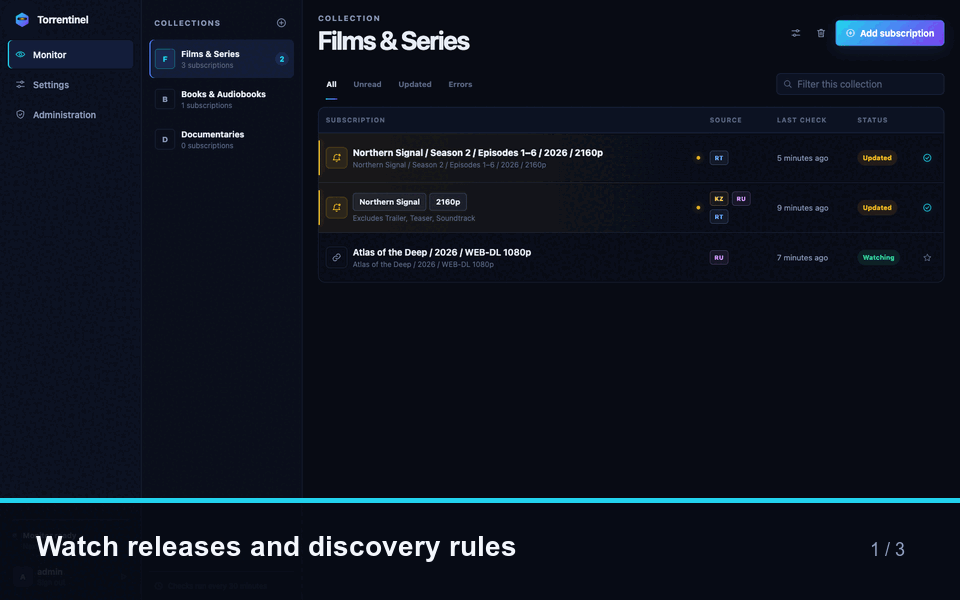
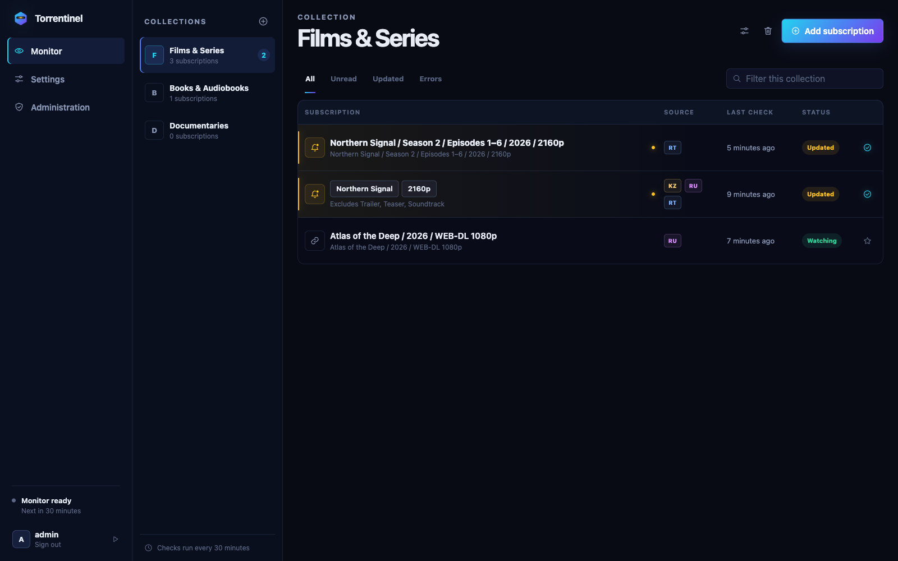
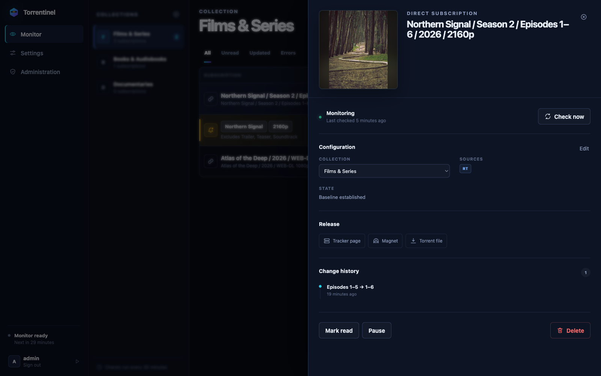
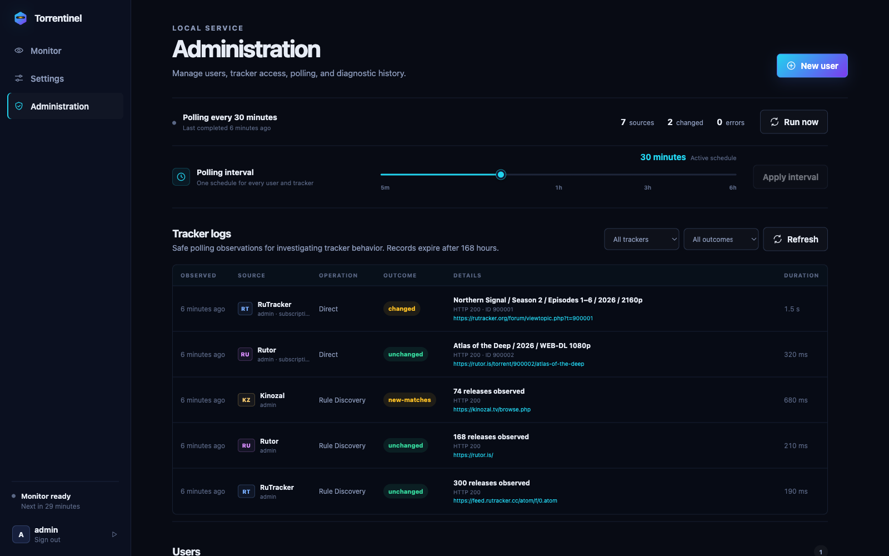
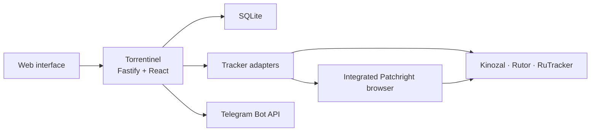

<meta name="google-site-verification" content="xchJFmR-94RP-zCzAMkMpK2YC7ROKEFirdHPKYobe_0" />

<p align="center">
  <picture>
    <source media="(prefers-color-scheme: dark)" srcset="https://raw.githubusercontent.com/ib0ndar/Torrentinel/main/public/brand/torrentinel-lockup.svg">
    <source media="(prefers-color-scheme: light)" srcset="https://raw.githubusercontent.com/ib0ndar/Torrentinel/main/public/brand/torrentinel-lockup-light.svg">
    
  </picture>
</p>

<p align="center">
  A private, self-hosted monitor for torrent release changes.
</p>

<p align="center">
  <a href="LICENSE"></a>
  <a href="https://github.com/ib0ndar/Torrentinel/actions/workflows/ci.yml"></a>
  <a href="https://hub.docker.com/r/bah0/torrentinel"></a>
  <a href="https://github.com/ib0ndar/Torrentinel/releases"></a>
</p>

Torrentinel watches the tracker topics and search phrases you care about and tells you exactly what changed: a re-uploaded torrent file, a new magnet, an updated title, fresh artwork or metadata, or a brand-new release that matches your phrases. Every account has its own collections, history, and unread inbox and can link its own Telegram bot, and the whole service, tracker browser included, runs as one self-hosted service or container.

<p align="center">
  
</p>

## Why Torrentinel?

On forum-style trackers such as RuTracker and Kinozal, releases change in place: a series topic gains episodes, an uploader replaces the torrent file, the title and artwork are updated. Torrentinel is built to follow exactly that. It is a notification-first watchlist: it tells you what changed and puts the release one tap away, and leaves downloading to the client you already use, so it never needs your download client's credentials.

**What sets it apart:**

- **It shows what changed, not just that something changed.** Every check fingerprints the title, cover, magnet, torrent file, and tracker metadata, and the history shows the previous and new values side by side. The first check is a silent baseline, and when a Torrentinel update changes how a tracker page is read, subscriptions are re-baselined silently instead of producing false alerts.
- **Rules find new releases for you.** Besides watching known pages, a rule watches several trackers at once for new releases whose titles contain every required phrase and none of the ignored ones, case-insensitively in Latin and Cyrillic. Each tracker uses the discovery method that suits it: RuTracker's feed, Rutor's list of recent releases, and Kinozal's search.
- **Gaps between polls are detected and filled.** RuTracker's rolling feed is buffered persistently and compared between polls. When a gap is detected, Torrentinel catches up with an authenticated search (with a RuTracker login configured), and Administration shows the feed window, the overlap, and the safety margin of the chosen polling interval.
- **One container, browser included.** Tracker logins, searches, and anti-bot challenges are handled by an integrated Patchright browser inside the same container or service, and its clearance survives restarts. There is no challenge-solver sidecar, no database server, and no cron job: one image, or one native Node.js service, with SQLite.
- **Built for a household, not just one person.** Each account has its own collections, history, unread state, tracker logins, personal mirrors, Telegram bot, language, theme, start page, and default views, isolated from the other accounts. Administrators create accounts; there is no public registration.
- **Notifications you can act on.** Telegram messages carry the cover art, title, tracker, what changed or which rule matched, size, and category, in each account's language, with buttons for the tracker page and the magnet link or torrent file. Deliveries are queued in the database, retried with backoff that respects Telegram's rate limits, and logged.
- **Secure by default.** There is no default password, tracker logins and bot tokens are encrypted with AES-256-GCM, and ports are published on the local machine only. Torrentinel refuses DNS-rebinding and cross-site requests and limits sign-in attempts, and its sandboxed browser stays on the tracker's own domains and cannot reach your local network. Cover downloads and tracker redirects never reach your local network either.
- **Transparent when something goes wrong.** Subscriptions that need attention are flagged and can be sorted first, and administrators can review every tracker request and Telegram delivery from the last seven days with its outcome, HTTP status, timing, and what was found (cover, magnet, torrent file).
- **A fast, considered interface.** An Activity inbox across all collections, server-side search and filters, addresses that survive reloads and Back/Forward, keyboard shortcuts, a phone layout with bottom navigation, English and Russian, and eight color themes plus Auto.

## Quick start with Docker Compose

This is the shortest complete deployment. It runs one Torrentinel image containing the application, Patchright, Chrome or Chromium, and a private virtual display. No browser sidecar or second service is required.

The first two commands ask GitHub for the latest stable release tag automatically and store it in `RELEASE`; there is no version number to replace manually.

```sh
release_url="$(curl -fsSL -o /dev/null -w '%{url_effective}' \
  https://github.com/ib0ndar/Torrentinel/releases/latest)"
RELEASE="${release_url##*/}"
git clone --branch "$RELEASE" --depth 1 https://github.com/ib0ndar/Torrentinel.git
cd Torrentinel
cp .env.example .env
# Edit .env now if the public URL or host port will differ, or to open Torrentinel from other devices.
docker compose config
docker compose pull
docker compose up -d
curl -fsS http://127.0.0.1:8080/api/health
```

Open the configured URL and complete the [first sign-in](#first-sign-in).

## Contents

- [Features](#features)
- [Screenshots](#screenshots)
- [Supported trackers](#supported-trackers)
- [Project status and platform scope](#project-status-and-platform-scope)
- [Installation](#installation)
  - [Direct installation on Linux](#direct-installation-on-linux)
  - [Docker Compose](#docker-compose)
  - [Podman Quadlet](#podman-quadlet)
- [Configuration](#configuration)
- [Operations and backups](#operations-and-backups)
- [Development and contributing](#development-and-contributing)
- [Responsible use and license](#responsible-use-and-license)

## Features

### Monitoring and discovery

- **Direct subscriptions** to tracker topics: the title, cover, magnet, torrent file, and tracker metadata are fingerprinted on every check, and any change is recorded with its previous and new values
- **Silent baselines:** the first check of a page or rule records a baseline without notifying, and when an update changes how Torrentinel reads a tracker page, existing subscriptions are re-baselined without false alerts
- **Rule subscriptions** across several trackers with required and ignored phrases, matched case-insensitively in Latin and Cyrillic; ignored phrases start with trailer, teaser, and soundtrack in English and Russian, and every rule keeps its matches with tracker links, magnets, and torrent files
- **Discovery suited to each tracker:** RuTracker's rolling feed, Rutor's recent-release list, and Kinozal's search
- **RuTracker feed continuity:** a persistent release buffer, overlap tracking between polls, gap detection, and authenticated catch-up search when a RuTracker login is configured, with a warning when the polling interval comes too close to the feed window
- **Per-subscription controls:** Check now, pause and resume, edit the link or the phrases and trackers, and move between collections
- **Integrated browser where a tracker needs it:** Kinozal login and search, RuTracker detail pages and catch-up search, and Rutor only when a challenge appears; logins and challenge clearance are kept between restarts
- Configurable polling from 5 minutes to 6 hours, one schedule for every account and tracker
- Global and personal tracker mirrors, and a persistent cover cache that keeps artwork available when an image host is down

### Activity and notifications

- **Unread inbox:** a subscription with new changes stays unread until you open its details; **Mark unread** keeps a reminder, and **Mark all read** works per collection or everywhere
- **Activity view** of changes across all collections, newest first and grouped by day, with old and new values and an unread count in the navigation
- **Telegram notifications per account:** each account links its own bot with a short-lived code and receives messages in its own language, with cover art (from the cache, the image's address, or an upload, falling back to text), what changed or which rule matched, size, and category
- **One-tap buttons** for the tracker page and the magnet link, served through your Torrentinel address because Telegram buttons cannot open magnet links directly, or the torrent file when there is no magnet
- **Reliable delivery:** notifications are queued in SQLite, delivered at least once, and retried with exponential backoff (up to six hours) that honors Telegram's rate limits; administrators see the delivery log and the queue

### Interface

- Collections with server-side search (case-insensitive in Latin and Cyrillic), All, Unread, and Errors filters with counts, sorting by last change, name, or needs attention first, and optional pagination with 10 to 100 entries per page
- **Every view has an address:** collection, filter, search, page, and sort survive reloads, bookmarks, and Back/Forward, and reloads and Back/Forward also restore the scroll position
- **Your own starting point:** a start page per account (Monitor or Activity) and a default view per collection (All, Unread, or Errors)
- Keyboard shortcuts: `/` search, `j`/`k` move between rows, `Enter` opens, `a` adds a subscription, `?` lists the shortcuts, `Esc` closes
- Keyboard-operable menus, dialogs, and panels with managed focus, and a phone and tablet layout with bottom navigation, checked automatically at widths from 320 to 1440 pixels
- English (default) and Russian interfaces and Telegram messages, selected per account
- Eight color themes, including two light themes and a high-contrast theme, plus Auto, which follows the device's light or dark mode
- Tracker markers shown as each tracker's website icon or as letter badges

### Accounts and administration

- Administrator-managed accounts with no public registration; new accounts get a private Inbox and a temporary password that must be changed at the first sign-in
- Collections, history, tracker logins, personal mirrors, Telegram bots, and preferences are isolated per account
- Users change their own password, which signs out their other sessions; when an administrator resets a password or disables an account, the user's sessions end and the sign-in page says why
- **Administration:** an overview with the scheduler and RuTracker feed coverage, users and roles, global mirrors, and diagnostics with a filterable seven-day tracker request log, Telegram deliveries, and the notification queue

### Security and privacy

- No default password: the first start generates one, keeps it readable only by Torrentinel, and deletes it after the first password change
- Tracker logins and Telegram bot tokens are encrypted with AES-256-GCM using a key kept outside the database, and are set only in the web interface, never in environment variables
- Ports are published on the local machine only by default, and requests addressed to unknown host names are refused to stop DNS rebinding
- HttpOnly, SameSite=Strict session cookies, refused cross-site requests, and sign-in attempt limits per address and account; unknown accounts take as long to reject as a wrong password
- The integrated Chrome runs in its sandbox, opens only the tracker's own domains, has no listening port, and connects through an internal proxy that refuses local and private network addresses
- Cover downloads and tracker redirects reach only public internet addresses, tracker responses are size-limited, and personal mirrors are limited to the tracker's own domains

### Deployment and operations

- One image with the application, Patchright, Chrome or Chromium, and a private virtual display; no sidecar, database server, or cron job
- Docker Compose, rootless Podman Quadlet, or a native systemd service on Node.js 22.20+
- `linux/amd64` and `linux/arm64` images with build provenance; every image build runs the full automated test suite
- Health endpoint with scheduler state and a container health check
- Automatic database migrations at startup, and a documented paired backup of the database and its encryption key
- Modular TypeScript tracker adapters with declared capabilities and contract tests

## Screenshots

### Monitor



### Subscription details



### Administration



## Supported trackers

| Tracker | Direct links | Rules | Login |
| --- | --- | --- | --- |
| [Kinozal](https://kinozal.tv/) | Yes | Yes | Required |
| [Rutor](https://rutor.is/) | Yes | Yes | No |
| [RuTracker](https://rutracker.org/) | Yes | Yes | Optional |

## Project status and platform scope

Torrentinel is pre-1.0 software. Releases may change configuration, tracker behavior, or database structure. Database migrations run automatically at startup, but rollback is not guaranteed; read the [changelog](CHANGELOG.md) and create a paired backup before every update.

Direct installation on a Linux host is supported with Node.js 22.20 or newer and a Patchright-compatible browser. The supplied systemd unit is the maintained service definition for this deployment method. Source-built container images target Linux on `amd64` and `arm64`; Docker Desktop may run them, but macOS and Windows hosts are not part of the maintained deployment test matrix.

Torrentinel does not claim a fixed CPU or RAM minimum because tracker activity and browser use vary. The integrated browser is the heaviest component and starts when Kinozal or RuTracker needs it, or when Rutor's HTTP fast path encounters an interactive challenge. The supplied container definitions provide 512 MiB of shared memory. Small hosts should monitor memory during browser-backed tracker operations.

## Installation

Torrentinel can be installed directly on a Linux host as a Node.js service, without Docker, Podman, or another container runtime. It can also run as one container. The integrated browser is launched by Torrentinel and retains reusable clearance state in the application-data directory.

| Method | Best for | Browser-backed tracker access | Host requirements |
| --- | --- | --- | --- |
| [Direct Linux installation](#direct-installation-on-linux) | Minimal overhead and direct service integration | Included when a compatible browser is installed | Node.js 22.20+, npm, Chrome/Chromium, a service manager |
| [Docker Compose](#docker-compose) | The shortest complete installation | Included | Docker Engine and Compose v2 |
| [Podman Quadlet](#podman-quadlet) | Rootless, systemd-managed containers | Included | Podman with Quadlet, systemd user services, cgroup v2 |

All methods require Git and `curl`, plus outbound HTTPS access to the configured trackers and Telegram when notifications are enabled. Each example resolves GitHub's latest stable release when you run it and uses that same tag for the remaining commands. Choose the final HTTP port and `PUBLIC_URL` before linking Telegram or placing Torrentinel behind a reverse proxy.

### Direct installation on Linux

Install a system-wide Node.js 22.20 or newer release, npm, and Git using the method recommended by your Linux distribution. Python 3, `make`, and a C/C++ compiler may also be required when npm cannot use a prebuilt native module. Confirm the runtime before continuing:

```sh
node --version
npm --version
git --version
```

Create a dedicated system account named `torrentinel` with your distribution's account-management tool. The account does not need an interactive shell. Build on the target host, or on a Linux system with the same architecture, libc, and Node.js ABI:

```sh
release_url="$(curl -fsSL -o /dev/null -w '%{url_effective}' \
  https://github.com/ib0ndar/Torrentinel/releases/latest)"
RELEASE="${release_url##*/}"
git clone --branch "$RELEASE" --depth 1 https://github.com/ib0ndar/Torrentinel.git
cd Torrentinel
npm ci
npm run build
npm prune --omit=dev
```

Install the built application, persistent directories, environment file, and supplied systemd unit:

```sh
sudo install -d -m 0755 /opt/torrentinel
sudo cp -a dist node_modules package.json package-lock.json /opt/torrentinel/
sudo install -d -o torrentinel -g torrentinel -m 0750 \
  /var/lib/torrentinel/database \
  /var/lib/torrentinel/application
sudo install -d -m 0755 /etc/torrentinel
sudo install -o root -g torrentinel -m 0640 \
  deploy/native/torrentinel.env \
  /etc/torrentinel/torrentinel.env
sudo install -o root -g root -m 0644 \
  deploy/native/torrentinel.service \
  /etc/systemd/system/torrentinel.service
```

Edit `/etc/torrentinel/torrentinel.env`. Set `PUBLIC_URL` to the address users will open. The supplied configuration binds to `127.0.0.1`; set `HOST=0.0.0.0` only when the application should accept connections directly from the network.

Start Torrentinel and verify it locally:

```sh
sudo systemctl daemon-reload
sudo systemctl enable --now torrentinel.service
sudo systemctl status torrentinel.service --no-pager
curl -fsS http://127.0.0.1:8080/api/health
```

Direct installations must provide a Patchright-compatible Chrome or Chromium binary. Use `BROWSER_CHANNEL=chrome` for an installed Google Chrome, or `BROWSER_CHANNEL=chromium` for the browser installed by Patchright. Browser package and display setup varies by Linux distribution; Docker Compose provides the reproducible container deployment path.

If the host does not use systemd, run `/usr/bin/env node /opt/torrentinel/dist/server/index.js` under its service manager with the variables from `deploy/native/torrentinel.env` and write access to both `/var/lib/torrentinel` subdirectories.

### Docker Compose

Docker Compose runs one Torrentinel container and stores persistent data in two named volumes. The application volume also retains the integrated browser profiles and their reusable login and challenge-clearance cookies.

```sh
release_url="$(curl -fsSL -o /dev/null -w '%{url_effective}' \
  https://github.com/ib0ndar/Torrentinel/releases/latest)"
RELEASE="${release_url##*/}"
git clone --branch "$RELEASE" --depth 1 https://github.com/ib0ndar/Torrentinel.git
cd Torrentinel
cp .env.example .env
```

Edit `.env`, especially `PUBLIC_URL`, `TORRENTINEL_PORT`, and `SESSION_COOKIE_SECURE`. Torrentinel listens on `127.0.0.1` by default, so it is reachable from this machine and from a reverse proxy here; set `TORRENTINEL_BIND_ADDRESS=0.0.0.0` (or the host's LAN address) to open it to other devices. Then validate and start the deployment:

```sh
docker compose config
docker compose pull
docker compose up -d
docker compose ps
curl -fsS http://127.0.0.1:8080/api/health
```

If `TORRENTINEL_PORT` is changed, use that port in the health-check URL. View logs with the commands in the [operations guide](docs/operations.md#logs).

`docker compose ps` should list only `torrentinel`. Chrome runs inside that container and does not expose a separate API or network port.

### Podman Quadlet

The supplied Quadlets run Torrentinel rootlessly under the current user's systemd manager. They are not specific to one Linux distribution, but they require Quadlet support and cgroup v2:

```sh
podman --version
podman info --format '{{.Host.CgroupsVersion}}'
systemctl --user --version
```

The cgroup command must report `v2`. Install the tagged deployment files and create a private local environment file:

```sh
release_url="$(curl -fsSL -o /dev/null -w '%{url_effective}' \
  https://github.com/ib0ndar/Torrentinel/releases/latest)"
RELEASE="${release_url##*/}"
git clone --branch "$RELEASE" --depth 1 https://github.com/ib0ndar/Torrentinel.git
cd Torrentinel
podman pull "docker.io/bah0/torrentinel:$RELEASE"
install -d -m 0700 "$HOME/.config/containers/systemd"
install -m 0644 \
  deploy/*.container deploy/*.volume \
  "$HOME/.config/containers/systemd/"
install -m 0600 \
  deploy/torrentinel.env.example \
  "$HOME/.config/containers/systemd/torrentinel.env"
```

Edit `~/.config/containers/systemd/torrentinel.env`, particularly `PUBLIC_URL` and `SESSION_COOKIE_SECURE`. The supplied Quadlet publishes TCP port `8999` on `127.0.0.1`; change `PublishPort` in `torrentinel.container` to `8999:8080/tcp` to open it to other devices. Enable the user manager at boot and start Torrentinel:

```sh
sudo loginctl enable-linger "$USER"
systemctl --user daemon-reload
systemctl --user start torrentinel.service
systemctl --user status torrentinel.service --no-pager
curl -fsS http://127.0.0.1:8999/api/health
```

The `.volume` Quadlets create `torrentinel_app` and `torrentinel_db` automatically. If systemd does not generate `torrentinel.service`, follow the [Podman troubleshooting guidance](docs/operations.md#troubleshooting).

### First sign-in

There is no default password. On first start, Torrentinel creates the account `admin` with a random password, saves it in `initial-admin-password` in the application-data directory (readable only by Torrentinel's user), and prints it in the log line starting `First sign-in:` until it has been changed. Read it with the command for your installation:

```sh
docker compose exec torrentinel cat /var/lib/torrentinel/initial-admin-password    # Docker Compose
podman exec torrentinel cat /var/lib/torrentinel/initial-admin-password            # Podman Quadlet
sudo cat /var/lib/torrentinel/application/initial-admin-password                   # Direct installation
```

To choose the first password instead, set `INITIAL_ADMIN_PASSWORD` (at least 8 characters) before the first start. Either way, Torrentinel asks for a new password at the first sign-in and deletes the saved file afterwards.

Configure tracker accounts, mirrors, and Telegram bots under **Settings**, where each account can also change its password later (**Settings → Account**; this signs out the account's other sessions). Manage users, global mirrors, the polling interval, and diagnostics under **Administration**.

## Configuration

A RuTracker login is optional for ordinary public-feed monitoring and required for authenticated recovery after a detected feed gap. The configured polling interval is the actual tracker request interval. Administration displays the rolling-feed window, consecutive-batch overlap, new-entry count, and safety margin.

Runtime settings are read from the process environment. The direct systemd installation uses `/etc/torrentinel/torrentinel.env`, Docker Compose uses `.env`, and Podman uses `~/.config/containers/systemd/torrentinel.env`.

| Setting | Direct Linux installation | Docker Compose | Podman Quadlet | Purpose |
| --- | --- | --- | --- | --- |
| `HOST` | `127.0.0.1`, editable | Fixed to image default `0.0.0.0` | Fixed to image default `0.0.0.0` | Application listen address |
| `PORT` | `8080`, editable | Internal port `8080` | Internal port `8080` | Application container/process port |
| `TORRENTINEL_PORT` | Not used | `8080`, editable | Not used | Docker host port mapped to internal `8080` |
| `TORRENTINEL_BIND_ADDRESS` | Not used | `127.0.0.1`, editable | `PublishPort` in `torrentinel.container`, default `127.0.0.1` | Host address the published port listens on; `0.0.0.0` opens it to other devices |
| `PUBLIC_URL` | Editable | Editable | Editable | Externally reachable URL without a trailing slash |
| `ALLOWED_HOSTS` | Editable, empty | Editable, empty | Editable, empty | Further domain names Torrentinel is opened under, comma-separated (a leading `.` includes subdomains); see [Host names](#host-names) |
| `INITIAL_ADMIN_PASSWORD` | Optional | Optional | Optional | Password for the first administrator account; generated when empty, see [First sign-in](#first-sign-in) |
| `DATA_DIR` | `/var/lib/torrentinel/database` | Fixed volume path `/data` | Fixed volume path `/data` | SQLite database directory |
| `APP_DATA_DIR` | `/var/lib/torrentinel/application` | Fixed volume path `/var/lib/torrentinel` | Fixed volume path `/var/lib/torrentinel` | Encryption key, cached covers, and browser profiles |
| `POLL_INTERVAL_MINUTES` | Editable, default `60` | Editable, default `60` | Editable, default `60` | Initial interval before an administrator saves a value |
| `POLL_STARTUP_DELAY_SECONDS` | Editable, default `20` | Editable, default `20` | Editable, default `20` | Delay before the startup poll |
| `TRACKER_REQUEST_TIMEOUT_MS` | Editable, default `30000` | Editable, default `30000` | Editable, default `30000` | Tracker HTTP timeout |
| `BROWSER_TIMEOUT_MS` | Editable, default `120000` | Editable, default `120000` | Editable, default `120000` | Integrated browser navigation and challenge timeout |
| `BROWSER_HEADLESS` | Editable, default `true` | Editable, default `false` | Editable, default `false` | Use headless mode; containers use a private virtual display by default |
| `BROWSER_CHANNEL` | Editable, default `auto` | Editable, default `auto` | Editable, default `auto` | `auto` selects Chrome on `amd64` and bundled Chromium on `arm64` |
| `BROWSER_SANDBOX` | Editable, default `auto` | Editable, default `auto` | Editable, default `auto` | Chrome sandbox: `auto` uses it when available, `true` requires it, `false` disables it; see [Integrated browser sandbox](#integrated-browser-sandbox) |
| `SESSION_DAYS` | Editable, default `30` | Editable, default `30` | Editable, default `30` | Login-session lifetime |
| `SESSION_COOKIE_SECURE` | Editable, default `false` | Editable, default `false` | Editable, default `false` | Set to `true` when the public URL uses HTTPS |
| `TRUST_PROXY` | Editable, default `false` | Editable, default `false` | Editable, default `false` | Reverse proxy addresses whose `X-Forwarded-For` is trusted (`true`, or a comma-separated list of addresses/CIDR ranges); sign-in limits then apply per client |

The standalone container image accepts all runtime variables directly. The supported Compose and Quadlet definitions intentionally fix their internal listen ports and data paths; use the documented host-port setting instead of changing container internals.

Tracker passwords and Telegram tokens are configured only in the web interface and are never environment variables.

### Host names

Torrentinel answers only requests addressed to a host name that cannot belong to someone else: an IP address, a single-word name such as `nas`, a local-only name ending in `.local`, `.lan`, `.home`, `.home.arpa`, `.internal`, or `.localdomain`, the host of `PUBLIC_URL`, or a name in `ALLOWED_HOSTS`. Other names receive HTTP 403 and a log warning. This stops DNS rebinding, where a web page reaches a server on the visitor's network under the attacker's own domain name. If you open Torrentinel under your own domain, such as one served by a reverse proxy, set it as `PUBLIC_URL` or add it to `ALLOWED_HOSTS`.

### Reverse proxy and HTTPS

When a reverse proxy terminates HTTPS, point it at Torrentinel's host port, set `PUBLIC_URL` to the final `https://` address (or add the proxy's domain to `ALLOWED_HOSTS`), and set `SESSION_COOKIE_SECURE=true`. Set `TRUST_PROXY` to the address the proxy connects from (for example `127.0.0.1` for the native service, or the container network's gateway for containers) so sign-in attempt limits apply to each client rather than to the proxy, and send `Strict-Transport-Security` from the proxy. The native service and the supplied Compose and Quadlet definitions listen on `127.0.0.1` by default and are ready for a proxy on the same host. A proxy in another container that connects through the host's LAN address needs the port opened to that address. The integrated browser has no listening port.

### Integrated browser sandbox

Torrentinel starts Chrome with its sandbox, which isolates web content from the rest of the application, and logs `The integrated browser runs Chrome with its sandbox.` the first time it does. With the default `BROWSER_SANDBOX=auto`, Torrentinel falls back to running Chrome without the sandbox when the environment cannot provide one, and logs a warning instead. Set `BROWSER_SANDBOX=true` to refuse to start Chrome without the sandbox.

Independently of the sandbox, the integrated browser only opens pages on the tracker's own domains and the configured mirror, cannot open further windows, and connects only through a proxy inside Torrentinel. The proxy resolves every host name itself and refuses local and private network addresses for everything except the tracker's own hosts, including requests from frames, workers, and WebSockets; WebRTC cannot send traffic around it.

- **Docker Compose:** the supplied `compose.yaml` applies `deploy/torrentinel-seccomp.json`. This is Docker's default seccomp profile (from [moby/profiles](https://github.com/moby/profiles/blob/main/seccomp/default.json)) with one added rule that lets processes create user namespaces, which Chrome's sandbox needs and Docker's default profile blocks.
- **Podman Quadlet:** Podman's default seccomp profile already allows the user namespaces Chrome's sandbox needs, so the supplied Quadlet needs nothing extra. If the log shows the fallback warning with an older Podman release, copy `deploy/torrentinel-seccomp.json` to `~/.config/containers/systemd/` and add `SeccompProfile=%h/.config/containers/systemd/torrentinel-seccomp.json` to the `[Container]` section of `torrentinel.container`.
- **Direct installation:** the sandbox works when the host allows unprivileged user namespaces. Some distributions restrict them (for example Ubuntu 24.04 with `kernel.apparmor_restrict_unprivileged_userns=1`); allow them for the Chrome binary in use or accept the fallback.

### Accounts and trust

Administrators are trusted with the whole installation. They manage accounts, see every account's tracker activity in Diagnostics, and set the global mirrors that tracker logins are sent to, so an administrator could capture other accounts' tracker passwords. Grant administrator rights only to people you would also give the server's data directory.

Other accounts are isolated from one another. A personal mirror may only use the tracker's own domains (for example `rutracker.net`) or the global mirror address; to use another mirror, an administrator sets it as the global mirror under **Administration → Mirrors**. Repeated failed sign-ins are limited per address and per account.

## Telegram notifications

Each Torrentinel user can connect a separate Telegram bot and account:

1. Create a bot with Telegram's [BotFather](https://t.me/BotFather).
2. Save the bot token in Torrentinel under **Settings**.
3. Generate a linking code and send the displayed `/start` command to the bot.

`PUBLIC_URL` must be reachable from the Telegram client for Torrentinel-hosted Magnet buttons to work.

## Architecture


```mermaid
flowchart LR
  Browser["Web interface"] --> App["Torrentinel<br/>Fastify + React"]
  App --> DB["SQLite"]
  App --> Plugins["Tracker adapters"]
  Plugins --> IntegratedBrowser["Integrated Patchright browser"]
  Plugins --> Trackers["Kinozal · Rutor · RuTracker"]
  IntegratedBrowser --> Trackers
  App --> Telegram["Telegram Bot API"]
```

The API, React interface, scheduler, Telegram worker, and SQLite access run in one Node.js process. RuTracker can start one serialized Chrome child process on demand; both processes remain inside the same service or container. Tracker-specific behavior is isolated behind shared direct-subscription and rule-discovery contracts under `server/trackers/plugins/`.

## Operations and backups

The [operations guide](docs/operations.md) contains health-response details, service and log commands, updates, paired backups, restoration precautions, troubleshooting, and uninstall instructions for all three deployment methods.

> [!IMPORTANT]
> The SQLite database and application-data directory form one backup set. The database contains encrypted integrations, while the matching generated key is stored in application data. Always stop Torrentinel and back up or restore both together.

## Development and contributing

Torrentinel requires Node.js 22.20 or newer.

```sh
npm ci
npm run dev:server
```

Start the web interface in another terminal with `npm run dev:web`. Run the verification suite before submitting changes:

```sh
npm run check:release
npm test
npm run build
```

See [CONTRIBUTING.md](CONTRIBUTING.md) for tracker-adapter conventions, data-handling requirements, and the complete pull-request checks. Report vulnerabilities according to [SECURITY.md](SECURITY.md).

## Responsible use and license

Torrentinel is general-purpose monitoring software. Operators are responsible for ensuring that configured tracker access and use comply with each tracker's rules and with applicable law. Torrentinel does not grant tracker access or permission to collect or redistribute content.

Torrentinel is available under the [GNU Affero General Public License v3.0](LICENSE). If you run a modified version on a network server and allow users to interact with it, the AGPL requires offering those users the corresponding source code for that modified version.

Torrentinel was created with assistance from GPT models by [OpenAI](https://openai.com/). The generated code was reviewed, tested, and integrated by the project maintainer.
